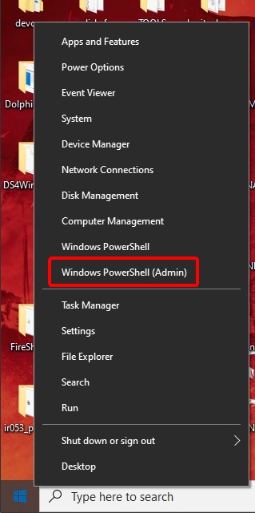
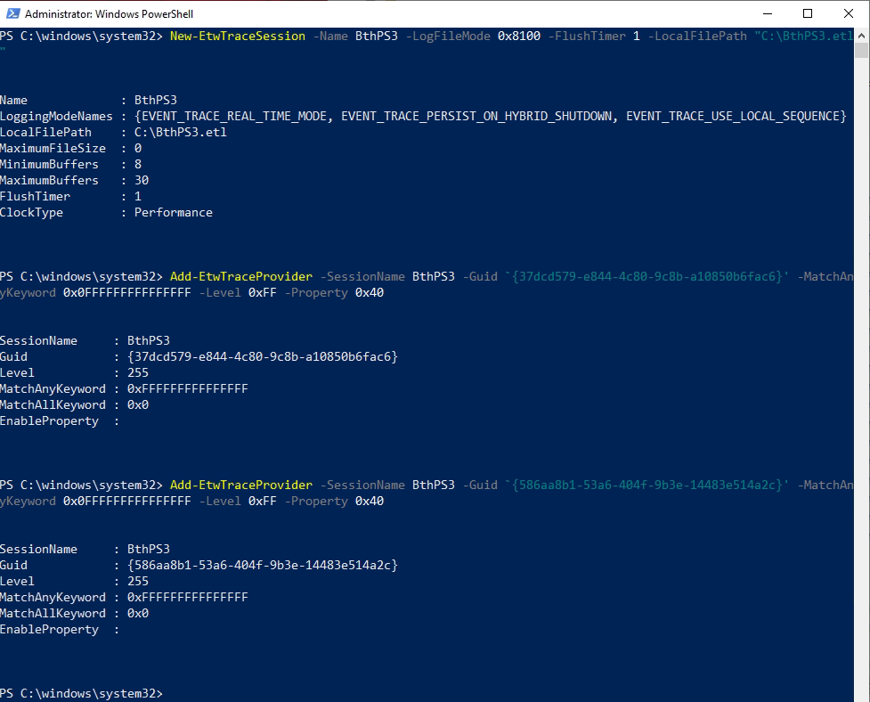
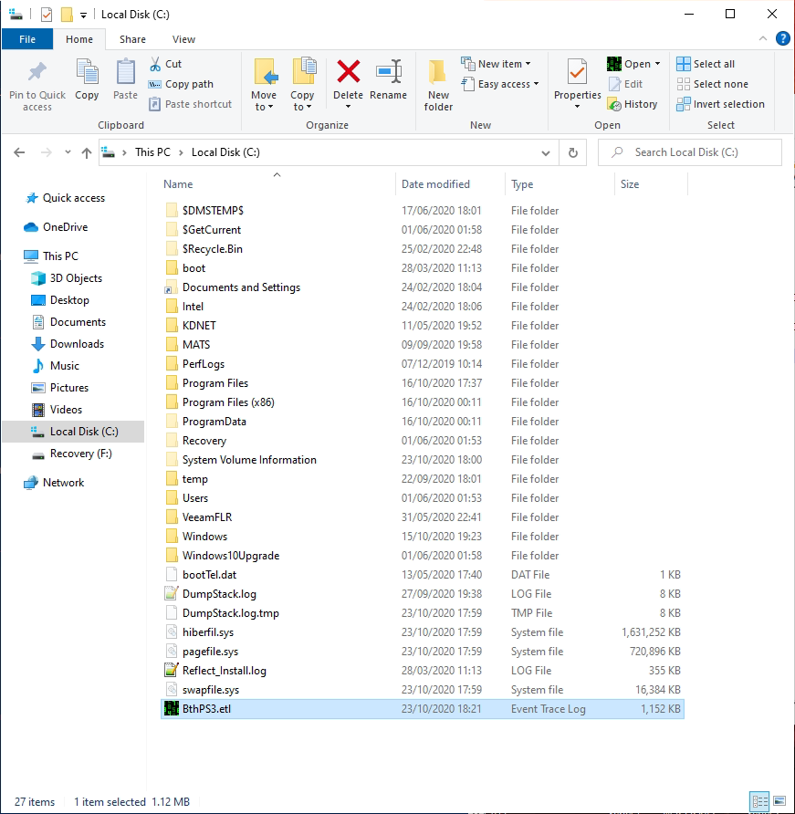
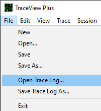
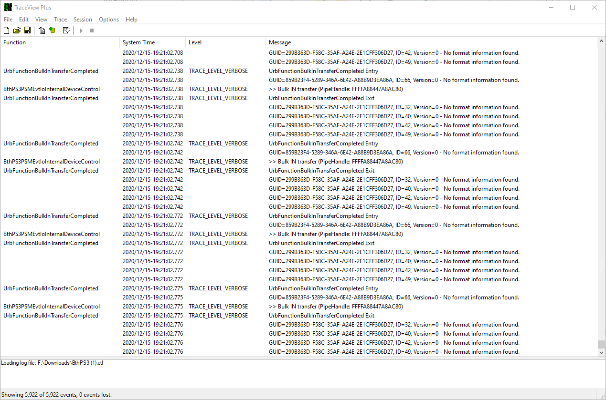
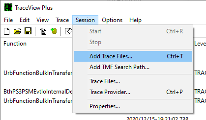
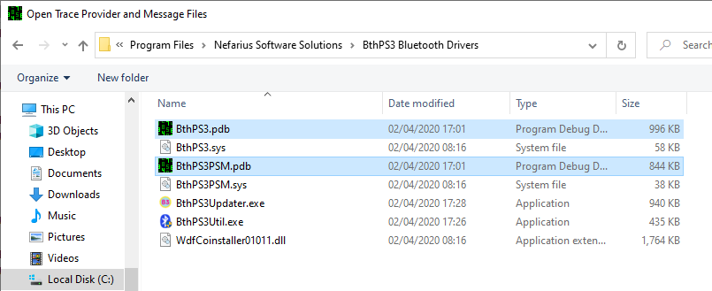
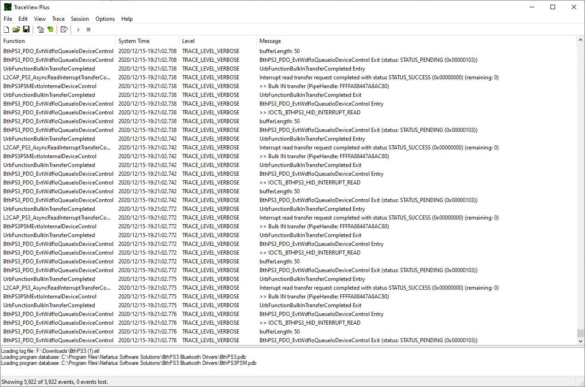

# Getting a kernel driver to talk

Kernel Drivers typically don't write traditional log files that end up on the disk somewhere, instead [Event Tracing for Windows](https://docs.microsoft.com/en-us/windows-hardware/test/wpt/event-tracing-for-windows) is used to write messages to a special logging facility we can tap into with a bit of command line magic.

## Prepare verbose tracing

Fire up PowerShell with administrative privileges by pressing ++win+x++ and selecting it from the appearing menu like so:

[](../../images/Y2bzZWdYK4.png){: .glightbox }

Keep it open until we're done, we'll need it throughout the process 😉

By default verbose tracing is **off**, which means we will lose a lot of potentially interesting information. To enable verbose tracing, execute the following commands in PowerShell:

!!! example "PowerShell"
    ```PowerShell
    Set-ItemProperty -Path "HKLM:\SYSTEM\CurrentControlSet\Services\BthPS3\Parameters" -Name "VerboseOn" -Type DWord -Value 1 -Force
    Set-ItemProperty -Path "HKLM:\SYSTEM\CurrentControlSet\Services\BthPS3\Parameters\Wdf" -Name "VerboseOn" -Type DWord -Value 1 -Force
    ```

After that **reboot the machine** before you proceed with the next step!

## Capture the trace

### Start trace session

Once you've got PowerShell open again, paste the following three lines into it "as is" and hit enter:

!!! example "PowerShell"
    ```PowerShell
    New-EtwTraceSession -Name BthPS3 -LogFileMode 0x8100 -FlushTimer 1 -LocalFilePath "C:\BthPS3.etl"
    Add-EtwTraceProvider -SessionName BthPS3 -Guid ‘{37dcd579-e844-4c80-9c8b-a10850b6fac6}’ -MatchAnyKeyword 0x0FFFFFFFFFFFFFFF -Level 0xFF -Property 0x40
    Add-EtwTraceProvider -SessionName BthPS3 -Guid ‘{586aa8b1-53a6-404f-9b3e-14483e514a2c}’ -MatchAnyKeyword 0x0FFFFFFFFFFFFFFF -Level 0xFF -Property 0x40
    ```

Should looks similar to this:

[](../../images/35cnHUOIwv.png){: .glightbox }

### Perform the action you want captured

Now is the time to attempt pairing a controller or whatever logic you wish to test and get captured in the trace log file.

### Stop trace session

Once everything we like to know has been captured, stop the session so the data collection stops and the log file is closed:

!!! example "PowerShell"
    ```PowerShell
    Remove-EtwTraceSession -Name BthPS3
    ```

The log file should now exist under the C:\\-Drive:

[](../../images/AnyDesk_LVe8LzooAQ.png){: .glightbox }

## Great, I got it, what now

So we've captured the `BthPS3.etl` file, but what now? Well, the easy way is to submit it to Nefarius for analysis 😁 Or, you can take a peek at its contents for yourself if you read on.

## Decipher the trace file content

The trace files are not readable with a traditional text editor, some special tools are required to get the spicy bits out of it. Microsoft provides tools for the task but they are awfully verbose and not easy on the beginner in the authors humble opinion, so use of a 3rd party tool is highly recommended.

### Using MGTEK TraceView Plus 3

Obtain a copy of [MGTEK TraceView Plus 3](https://www.mgtek.com/traceview) and install it.

!!! important "MGTEK TraceView Plus 3"
    This software is **not** freeware. It offers a free evaluation version with a generous time of 30 days trial limit and a simple nag screen. If you plan on utilizing its features frequently [you can obtain a licensed copy on their shop](https://www.mgtek.com/traceview/shop). Thanks for supporting great software 🥰

You should now be able to simply double-click the `BthPS3.etl` we created before and it should open in TraceView Plus. If not, open Trace View Plus and use `File / Open Trace Log...` and navigate to the `BthPS3.etl` file like so:

[](../../images/HaKTOUJbIE.png){: .glightbox }

Once opened you should see some oddly formatted lines similar to this:

[](../../images/TraceView_PZJBtRmyn5.png){: .glightbox }

Trat's no good, TraceView Plus needs some information on how to decode the content into a useful format. So we navigate to `Session / Add Trace Files...` like so:

[](../../images/TraceView_OtoTHylNPh.png){: .glightbox }

Now navigate to the BthPS3 installation folder on your local drive and select **both** PDB files like shown:

[](../../images/TraceView_GC5KAg7ee8.png){: .glightbox }

Now the display should change and readable text will appear:

[](../../images/TraceView_ju8ERmEEUL.png){: .glightbox }

Alright, now you can navigate the content of the trace, newest events on the bottom, oldest on top.

## Fancy, but what do I do with that

Once you've made it this far, you can see the inner workings of the drivers. Have a look for the levels `TRACE_LEVEL_WARNING` or `TRACE_LEVEL_ERROR`, which indicates a failure in the driver. This hints at the potential issue with the connection, which may or may not be solvable.
