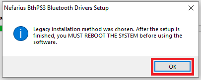

# How to Install  

## - Before You Begin:  

- This set of drivers has been designed for and tested with the original Sony PlayStation **3** peripherals, better known by the names SIXAXIS, DualShock and Navigation controller. If your controller works, great! Take it as a win. However, if it does not, please do not contact support as there is nothing we can do.  
- Do *not* attempt to pair a PS3 Controller on Windows via the built-in device discovery dialog, like:  
  
This will **not work** and can cause Bluetooth connection to fail completely.  
To check if you did, open the Bluetooth Settings page within Windows and check the list for entries similar to:  

  
If you see this, simply select it and click the "Remove device" button.  

- For the setup to work correctly **Windows UAC needs to be enabled**. If in doubt, the following page has instructions on how to check its status: [link here](https://articulate.com/support/article/how-to-turn-user-account-control-on-or-off-in-windows-10)   

## - Installing BthPS3 Drivers:  

!!! note "Note:" 
    The following steps are only required if you plan on using your PS3 controller wirelessly over Bluetooth. If you just plan on using a USB cable, then all you need is [DsHidMini](../DsHidMini/index.md).  

- If you had the DsHidMini installation wizard download the BthPS3 install file for you, you should be able to find it in your "Downloads" folder. It should be named Nefarius_BthPS3_Drivers_x64_arm64_vx.x.x.msi (where the x's represent the current version number). If you didn't (or if for some reason can't find it there), you can download it directly from the official BthPS3 GitHub Releases page [here](https://github.com/nefarius/BthPS3/releases).  
- Double click on the installation file to start the Installation Wizard, then click "Next".
  
- The next screen is the "End-User License Agreement". Read through the agreement and click the box to accept the terms. Then click "Next". 
  
- The next screen shows what drivers will be installed.  The "BthPS3 Bluetooth Drivers" and "Open post-installation article" is selected by default.  Leave those checked and click "Next".  
  
- The next screen asks if you want to use the the "Modern hot-plug" or "Legacy sequential" method to install the drivers. The modern method does not require you to restart your computer, but doesn't work for all Bluetooth receivers.  The legacy method should always work, but requires you to restart your computer afterwards. For the purposes of this guide, I am using the "Legacy" method. Make your choice, then click "Next".  
  
- The UAC window should pop up asking if you are ok with the wizard making changes to your computer. If you don't see it, check your task bar for a shield icon and click that. After clicking "Yes" the installation wizard will continue.  
  
- If using the Legacy Method, you will be told to reboot your computer. Click "OK". (We will restart our computer at the end).  
  
- After the BthPS3 Drivers have been installed, a webpage will open with some important information. Please read through it. When done, click "Finish" to close the wizard. You can now restart your computer.  
  
- **Congratulations!!** BthPS3 is now installed! You may now plug in your controller via USB cable which will automatically pair your controller for Bluetooth. Remember, this is the only way you should be pairing your controller.