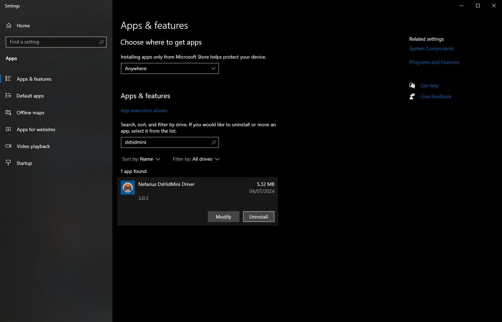

# Welcome to Version 3 Beta Testing

Ahoy there! 👋 If you can read this you're most probably part of the DsHidMini Version 3 Beta crew, welcome!

Please read this article thoroughly before continuing to use the software or asking questions about it.

## Participation rules

The dev team is small, like, *really* small, so we have no time for any BS. If you want to help us find and fix bugs, some rules are inevitable or the ride won't be any fun.

- Participating in a Beta implies you are somewhat comfortable with advanced Windows/PC usage and able to solve problems on your own. **Do not use the Beta releases if you just want to get gaming ASAP, use the stable version 2 releases instead!**
- Before asking questions about what new features are available or which bugs were fixed **check both the [open](https://github.com/nefarius/DsHidMini/milestone/7) and [closed](https://github.com/nefarius/DsHidMini/milestone/7?closed=1) issues and PRs on GitHub** first! We know reading is annoying but so is repeating answering the same questions over and over again to us.

## Important facts

- The mandatory redirect to this page will **NOT** be removed until a stable public release becomes available.
- The documentation on this site is **still written for version 2** and some sections might no longer apply to version 3.
- Version 3 uses a completely different configuration system so the old `DSHMC.exe` **can not be used with version 3**.
    - You can download the latest build of the new control app [from here](https://buildbot.nefarius.at/builds/DsHidMini/latest/bin/ControlApp.exe), requires [.NET Desktop Runtime 8](https://dotnet.microsoft.com/en-us/download/dotnet/8.0).
- The `igfilter` version `v1.1.0.0` copy shipped with DsHidMini version 2 **does not work with version 3** and needs to be updated to *at least* `v1.1.1.0` or newer.
    - The setup you ran takes care of removing all outdated components and installing upgraded variants.
- The driver configuration is now loaded from a **JSON file** named [`DsHidMini.json`](https://github.com/nefarius/DsHidMini/blob/master/sys/DsHidMini.json) which has to be put in `C:\ProgramData\DsHidMini` to get picked up.
    - The GUI tool to edit the configuration **is not yet done**, you are welcome to experiment with settings on your own though, study the [example `DsHidMini.json` file](https://github.com/nefarius/DsHidMini/blob/master/sys/DsHidMini.json) and tinker with it. The provided options may change as the beta driver still evolves.
    - The documentation of all JSON directives is **not yet done**.

👉 You can follow development progress and chats about the solution on our Discord. I leave finding it as an exercise to the user 😉

## Highlights

The following features are considered done and have been tested to the best of the abilities to a two-head development team 😉

- Native **Xbox One Controller emulation**
    - Test as many modern games in this mode as you like, [feedback welcome](https://github.com/nefarius/DsHidMini/discussions/114)!
- Full Windows 11 compatibility
- ARM64 builds of the driver
    - Currently **untested**, feedback welcome!
- To be filled...

## Removal

All Beta v3 components can be removed in one go by just uninstalling `Nefarius DsHidMini Driver` in Apps & features:

Afterwards you can switch back to v2 via the existing [installation article](../How-to-Install.md).
