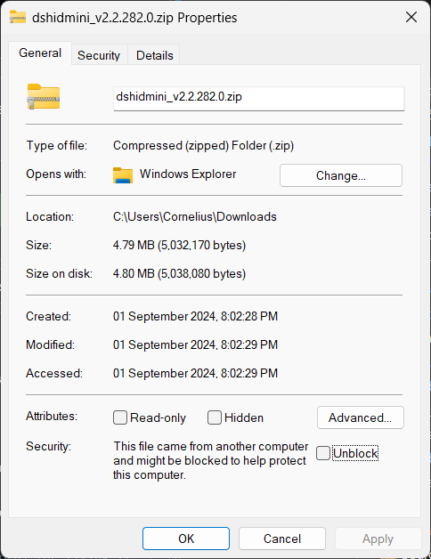
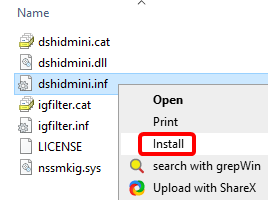
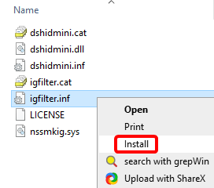
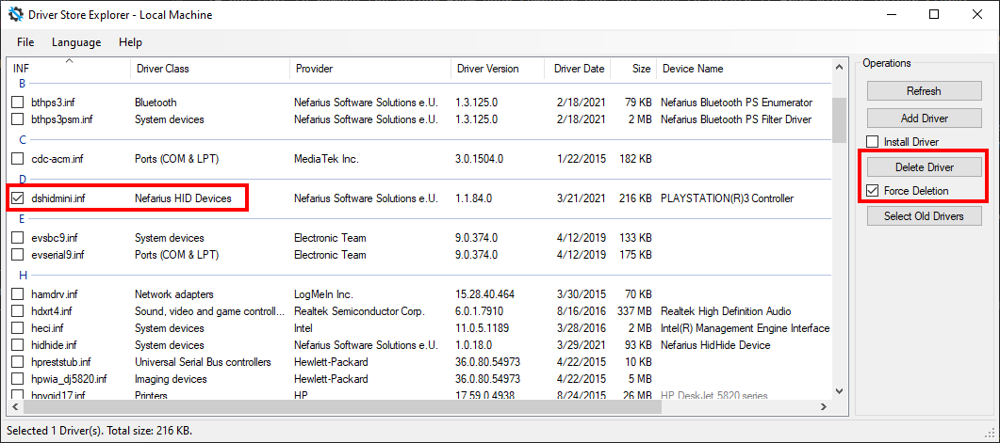
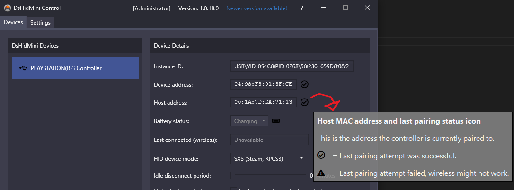

# How to Install/Remove

DsHidMini can only work its magic if it's the dominant driver for your controller, you may have others preinstalled that need removal, this guide covers most of the known cases.

!!! danger highlight "Do NOT attempt manual PAIRING with the Windows built-in methods!"
    Do *not* attempt to pair a PS3 Controller on Windows via the built-in device discovery dialog, like:
      
    This will **not work** and can cause Bluetooth connection to fail completely, **so do not this!**  
    
    Check the [F.A.Q.](FAQ.md#i-did-everything-right-and-it-just-wont-connect-via-bluetooth) for fixing if you did so!

## Installation

!!! danger highlight "STOP trying to use DsHidMini with random controllers"
    Only and **only** this controller (Sony DualShock 3 a.k.a. PS3 Gamepad) is supported:  
      
    Do NOT contact support for any other device, **it will not work**, no matter how many times you ask!

No matter what software you may have preinstalled, this step is always the same 😀

### Version 2.x.x

This is the current latest stable major version.

- **Make sure your UAC is enabled** ([see here](https://articulate.com/support/article/how-to-turn-user-account-control-on-or-off-in-windows-10))!
- **If you want Bluetooth support** you need to [install BthPS3 first](https://github.com/nefarius/BthPS3/releases/latest) (optional for USB)
- [Grab the release from GitHub](https://github.com/nefarius/DsHidMini/releases/latest)
- Download the attached `dshidmini_vX.X.X.X.zip` archive to an arbitrary location on your machine
- **Unblock the archive** if it's blocked
    - Right-click, properties on the archive, then **tick** `Unblock`  
      
- Extract the archive (doesn't matter where to, e.g. your Downloads folder)
- [Make sure you know your architecture](../../../research/How-to-check-architecture.md)
    - On x64 navigate to `x64\dshidmini`
    - On x86 navigate to `x86\dshidmini`
- Right-click on `dshidmini.inf` and select Install  
    
    - If you've never installed great software before 😉 this might show up (hit Install):  
    
    - Should only take a moment until success dialog (may *not* appear on Windows 11, just continue)  
    
- Right-click on `igfilter.inf` and select Install (**do not miss this step**)  
    
- Now **connect your controller via USB**
    - 🐵 This will automatically pair it to your Windows Bluetooth host *if* you have working Bluetooth at the time of plugging it in 🐵
- With your controller connected by USB, open the DsHidMini Control Utility (the `DSHMC.exe` file that comes along the driver archive) to see if the controller gets detected
    - Run it as Administrator to change settings, [check the documentation for details](HID-Device-Modes-Explained.md)
    - It is not required to keep the utility running for the driver to function, only if you want to observe battery level or change settings

By now if you plug in your controller (or reboot the machine) chances are high that everything already works as expected. If it doesn't, worry not, [read on here](#troubleshooting)!

??? info "Version 1.x.x"

    !!! important "Obsolete version"
        Version 1 has been deprecated and replaced by version 2, which is not backwards compatible, so study the installations instructions carefully and make sure     you use the versions outlined!
    
    - **If you want Bluetooth support** you need to [install BthPS3 first](https://github.com/nefarius/BthPS3/releases/tag/setup-v1.3.127) (optional for USB)
    - [Grab the release from GitHub](https://github.com/nefarius/DsHidMini/releases/tag/v1.4.222.0)
    - Download the attached `dshidmini_vX.X.X.X.zip` archive to an arbitrary location on your machine
    - Extract the archive (doesn't matter where to, e.g. your Downloads folder)
    - [Make sure you know your architecture](../../../research/How-to-check-architecture.md)
        - On x64 navigate to `x64\dshidmini`
        - On x86 navigate to `x86\dshidmini`
    - Right-click on `dshidmini.inf` and select Install
        
        - If you've never installed great software before 😉 this might show up (hit Install):  
        
        - Should only take a moment until success dialog  
        
    - Now **connect your controller via USB**
        - This will automatically pair it to your Windows Bluetooth host *if* you have working Bluetooth at the time of plugging it in
    - With your controller connected by USB, open the DsHidMini Control Utility (the `DSHMC.exe` file that comes along the driver archive) to see if the controller gets detected
        - Run it as Administrator to change settings, [check the documentation for details](HID-Device-Modes-Explained.md)
        - It is not required to keep the utility running for the driver to function, only if you want to observe battery level or change settings
    
    By now if you plug in your controller (or reboot the machine) chances are high that everything already works as expected. If it doesn't, worry not, [read on here](#troubleshooting)!

## Updating

If you want to update, simply [follow all the same steps of the installation](#installation) and overwrite any existing files. Reboot your machine to be extra safe if it didn't work right away.

## Removal

If you want to remove DsHidMini from your computer you first need to delete it from Windows Driver Store:

- Use [Driver Store Explorer](https://github.com/lostindark/DriverStoreExplorer/releases) to remove the `dshidmini.inf` driver:  
  
The driver will still be loaded for controllers that were using it, so be sure to uninstall them from Device Manager  
- Plug in your controllers
- Open Device Manager by pressing ++win+x++ and select it from the menu:  
  
- Expand `Nefarius HID Devices`
- For each device under `Nefarius HID Devices`, right click it and select `Uninstall Device`, then select `Uninstall` on the appearing confirmation window  
  

After that, DsHidMini should be fully gone from your computer 😥

## Troubleshooting

### Verifying if the controller is loading the correct driver

The driver can't do anything if it is not being used, so to check this:

- Connect your controller **by USB** cable
- Open Device Manager by pressing ++win+x++ and select it from the menu
- Search for and expand the category `Nefarius HID Devices`, your controller should appear there. Double click on it to check the driver status:  

If the device appears there but the driver status indicates some error (e.g. `This device cannot start (Error Code 10)`) try pressing the `Reset` button on the back of your controller and then reconnecting it. Rebooting your computer is also worth a shot.

If the controller does not appear under `Nefarius HID Devices` or if this section doesn't exist at all, you probably have another driver taking priority over DsHidMini. To solve this you need to remove those rogue drivers. See how to do so on the [*removing conflicting drivers*](#removing-conflicting-drivers) section.

### Removing conflicting drivers

We need to first determine if any other conflicting device driver is present on the system and remove it so DsHidMini can take over that job. The steps outlined here may or may not be applicable to your system, it entirely depends on your past 😜 and the stuff you potentially installed. Worry not though, together we shall succeed ✨

#### ScpToolkit

If you had ScpToolkit installed, you need to purge every remains from your machine. [Follow this comprehensive removal guide](../../ScpToolkit/ScpToolkit-Removal-Guide.md).

#### Official Sony driver

If you have/had PS Now installed, chances are high you have the official Sony `sixaxis.sys` on your system. [Follow this procedure to remove it](SIXAXIS.SYS-to-DsHidMini-Guide.md).

#### FireShock

If you've used [Shibari](https://github.com/nefarius/Shibari) before you probably have FireShock installed. [Follow this procedure to remove it](../../FireShock/Removal-Guide.md).

### Controller does not connect by Bluetooth

Let's go step-by-step with this:

- Open Device Manager by pressing ++win+x++ and select it from the menu
- [Check if your Bluetooth Link Manager spec is supported](https://github.com/nefarius/BthPS3#supported-bluetooth-host-devices)
- Check if BthPS3 is correctly installed, its status and if its version is `v1.3.108` or higher:

- Connect your controller by USB
- Open the DsHidMini Control Utility (`DSHMC.exe` file that comes along the driver archive)
- Check if your device is correctly paired to the current Bluetooth host address. If it's not, try reconnecting your controller by USB sometimes until the pairing completes successfully

- If the "pairing" check is _Ok_ like in the picture above but the device is still not connecting by Bluetooth, **try resetting your controller by pressing the `reset` button on its back**, connecting by USB again to have it re-paired to the current Bluetooth address then trying connecting wireless again. Remember to always confirm in the DsHidMini Control UI Tool if the pairing was successful before trying to connect wireless

If after all those tries the device still fails to connect, then ***maybe***:

- Your Bluetooth dongle is somehow faulty/unsupported. Try with another model. Also, try using DsHidMini and BthPS3 in another computer or notebook with Bluetooth support to try your luck
- You may have a fake, copy-cat DS3 controller that uses insecure connections (unsolvable issue). [Be sure to see how to check if this is the case](https://github.com/nefarius/DsHidMini/issues/61)
- You have a fake/copycat controller that expects some specific PS3 behavior that is not mimicked by DsHidMini. **This project is focused on official Sony controllers, so aftermarket controllers may or may not work. As such, if a fake controller does not connect via Bluetooth you are on your own and we kindly ask you to refrain from opening support tickets!**
