# Manual removal of ScpToolkit residue

!!! attention "🚨 There's a tool available to automate driver removal 🚨"
    To quickly get rid of the drivers shipped with SCP you can use [the Legacinator](https://github.com/nefarius/Legacinator) in addition to this guide!

This article will walk you through the process of removing any traces of various versions of [ScpToolkit](https://github.com/nefarius/ScpToolkit) from your machine 😊

## How to determine ScpToolkit version

If you're not sure if you're either running version 1.6.x or 1.7.x you can check this by going to [Programs and Features](https://support.4it.com.au/article/shortcut-opening-programs-features-windows-10-8-1-7/) and inspect the version column like demonstrated below:

[](../../assets/uploads/files/1547648848565-93cffbdb-ab71-4467-8c36-3d411e25a17c-image.png)

In this case, version **1.6.x** is installed and the according removal procedures apply.

!!! important "Don't worry if it's not there"
    If you don't find this entry because your installation is damaged or partially removed, don't worry, just read on and try all the steps provided in this guide!

## Stop processes, remove the service

!!! warning "Administrative permissions required"
    Make sure to run the following commands in an [administrative prompt](https://www.thewindowsclub.com/how-to-run-command-prompt-as-an-administrator)!

These instructions terminate all SCP components that might currently run:

!!! example "CMD"
    ```shell
    taskkill /F /IM ScpServer.exe
    taskkill /F /IM ScpMonitor.exe
    taskkill /F /IM ScpTrayApp.exe
    ```

Should look similar to this output (notice that the server wasn't running, therefore displaying an error):

[](../../assets/uploads/files/1547641628112-kill-scp-processes.png)

If none were running, that's perfectly fine, just continue.

Now let's stop and delete the background service:

!!! example "CMD"
    ```shell
    sc stop Ds3Service
    sc delete Ds3Service
    ```

Resulting in:

[](../../assets/uploads/files/1547641584655-remove-scp-service.png)

!!! important "Errors can be ignored"
    Depending on your installation, the service might not be installed. In that case, just ignore reported errors.

## Remove drivers from v1.6

!!! warning "Connect all your devices"
    For this procedure to work properly make sure you've got your controller(s) and Bluetooth dongle(s) connected. If you don't have enough USB ports just repeat the described steps for each device, plugging it in one after another.

Download and run the [DriverStore Explorer](https://github.com/lostindark/DriverStoreExplorer/releases/latest) tool. We'll use this to safely remove the driver files from the system. Make sure to run it with administrative permissions!

You'll be presented with a list of drivers found on your machine:

[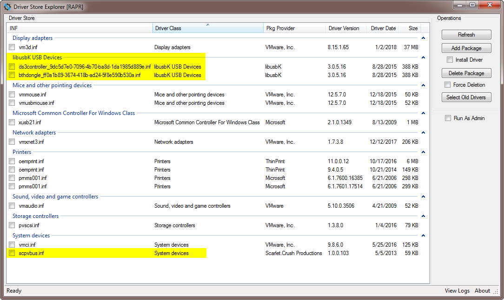](../../assets/uploads/files/1547643402664-rapr-scp-devices.png)

The highlighted entries belong to the toolkit installation. Select those, tick the `Force Deletion` box on the right and then click `Delete Package`:

[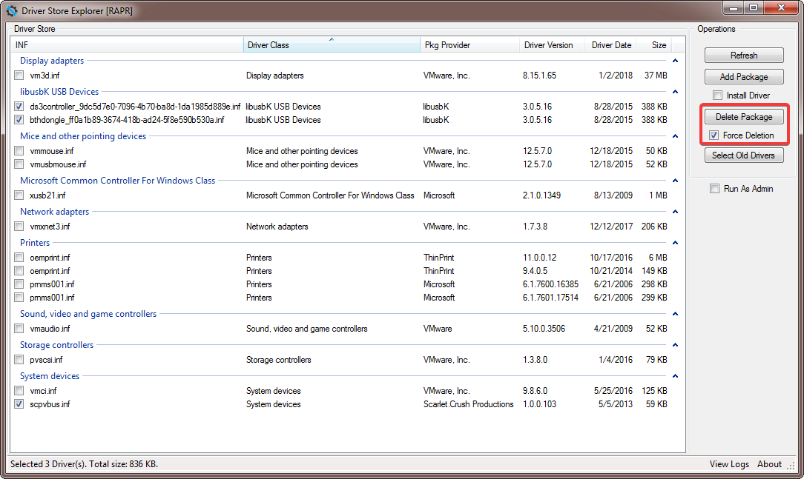](../../assets/uploads/files/1547643432079-2018-09-29_13-20-55.png)

Confirm the, uhm, confirmation 😃

[](../../assets/uploads/files/1547643922531-rapr-remove-confirm.png)

A few moments later they shall be gone:

[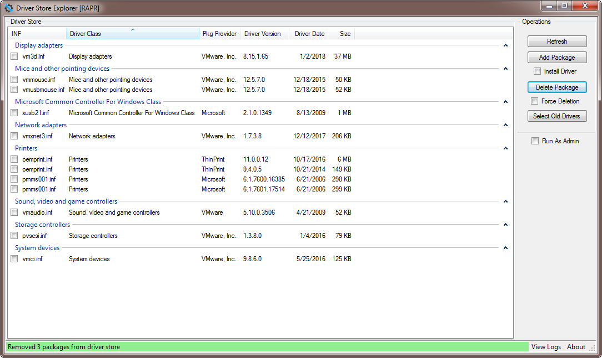](../../assets/uploads/files/1547643935439-rapr03.png)

Sweet! Now we need to instruct Windows to revert the devices to their default drivers. Open [Device Manager](https://www.lifewire.com/how-to-open-device-manager-2626075) and look for a node titled `libusbK USB Devices`:

[](../../assets/uploads/files/1547643950981-libusbk-highlighted.png)

Expanding said node shall reveal the devices running under SCP's drivers:

[](../../assets/uploads/files/1547643967570-device-highlighted.png)

Right-click on each of those and select `Uninstall`:

[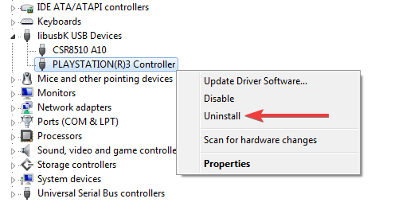](../../assets/uploads/files/1547643982017-device-uninstall.png)

We're sure we wanna do that 😋

[](../../assets/uploads/files/1547644007870-uninstall-ds3-confirm.png)

Same goes for the Bluetooth host:

[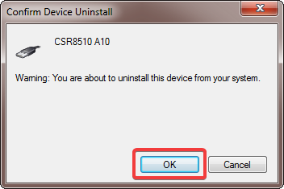](../../assets/uploads/files/1547644021917-uninstall-bth-confirm.png)

Alternatively the section and device names may differ, depending on your specific case, like so:

[](../../assets/uploads/files/1580151517398-b0d1f211-5657-44a3-85dc-bb72e5ea8c5d-image.png)

!!! warning "There's a catch"
    You might think that you're done now but there's a twist! A copy of the driver can still remain in memory and therefore won't be deleted. I strongly recommend you **re-plug all devices** and check if they are still running under the SCP drivers!

If your controller or Bluetooth dongle is *still* showing up in the `libusbK` node, right-click, uninstall and re-plug until it's gone for good :astonished:  

[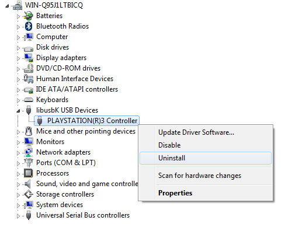](../../assets/uploads/files/1547671642726-2019-01-16-21_44_43-device-manager.png)

Observe and repeat carefully or you'll be left with unusable devices :point_up:

If you've done well, this is how your devices should pop up as again:

[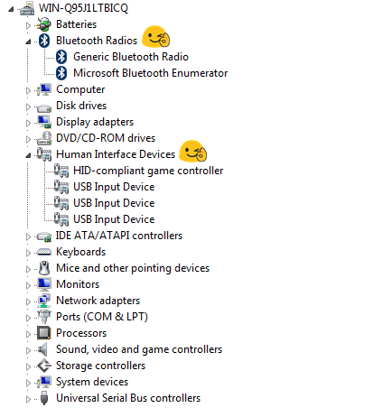](../../assets/uploads/files/1547672111087-ff77611b-ba07-466f-89da-c75a716d081c-image.png)

Great! Now there's the Bluetooth dongle back running the default Windows drivers and the controller is under Human Interface Devices where it belongs :ok_hand:

## Remove drivers from v1.7

The procedure for 1.7 is very similar to the steps described for 1.6 above, except that the node you'll find the devices under is called `Universal Serial Bus devices`:

[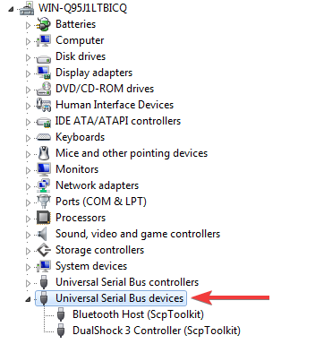](../../assets/uploads/files/1547673295517-898c75c5-3a06-436d-a617-78f2628f126c-image.png)

In Driver Store Explorer, things will pop up slightly different, nevertheless select and force removal:

[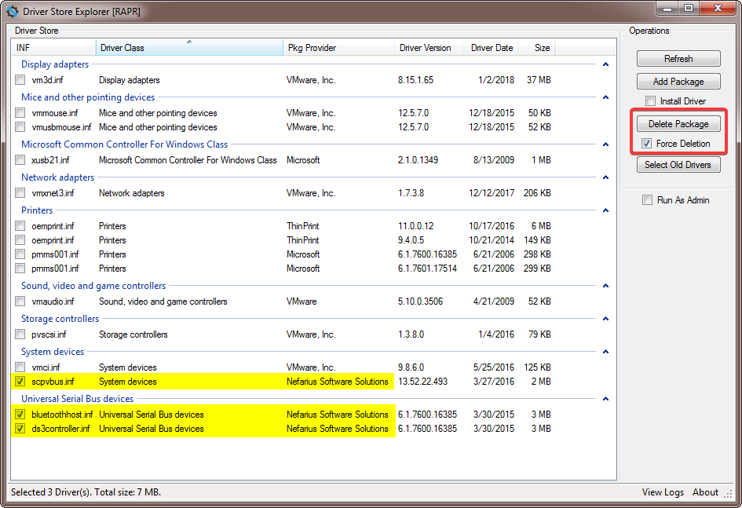](../../assets/uploads/files/1547673553885-6af98579-e5ee-4e6c-b141-c25e9e514092-image.png)

Then, in Device Manager go through the same "right-click, Uninstall" procedure:

[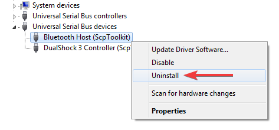]()

Rinse and repeat until the devices won't show up under this node anymore.

## Remove SCP Virtual Bus driver

While still in Device Manager, expand the `System devices` node:

[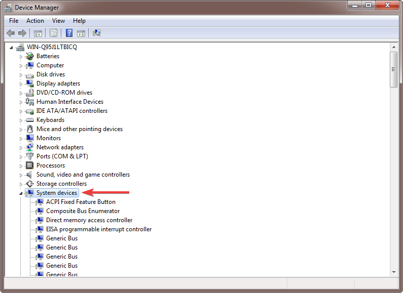](../../assets/uploads/files/1547648276291-16bc680c-3bce-4c67-b63a-7d9270bcb456-image.png)

Locate the device named `Scp Virtual Bus Driver`:

[](../../assets/uploads/files/1547648356789-c1d504bc-b769-4114-8520-90cfe6ff032f-image.png)

Same deal here; right-click, select `Uninstall` and confirm:

[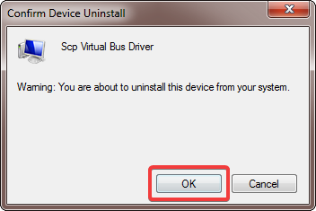](../../assets/uploads/files/1547648431488-0e145c30-934b-4c9e-a1c1-9bcdefe55e7e-image.png)

## But are the drivers really gone though?

Not sure if everything's cleaned up like it should? :thinking_face:  Devices still not showing up normally or behaving funny? :clown_face: How about this:

- Get the free tool [DevManView from Nir Sofer](https://www.nirsoft.net/utils/device_manager_view.html) (download link at the bottom of the page)
- Extract it somewhere
- Launch the `DevManView.exe` executable (you'll be prompted to give administrative consent)
- Look for entries with `Device Name` like
    - `Scp Virtual Bus Driver`
    - `Bluetooth Host (ScpToolkit)`
    - `DualShock 3 Controller (ScpToolkit)`
    - `DualShock 4 Controller (ScpToolkit)`

Example of some ScpToolkit **v1.7.x** residue:

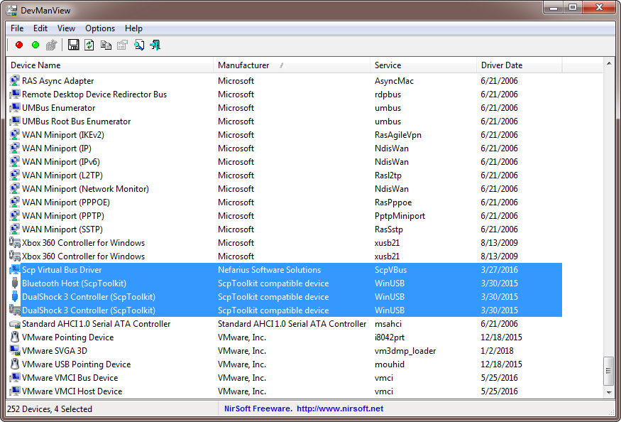 

If that's the case scroll back up and have a go at it again :smile: 

## Remove program files

As a last step you can now safely delete the ScpToolkit installation directory, typically `C:\Program Files\Nefarius Software Solutions\ScpToolkit` (may be subject to change depending on your installation, consult your brain memory to find the correct path :wink: )

## Congratulate yourself and reboot

You've done it! :tada: You escaped the curse! Give yourself a pat on the back and reboot your PC, just to be sure :wink:
