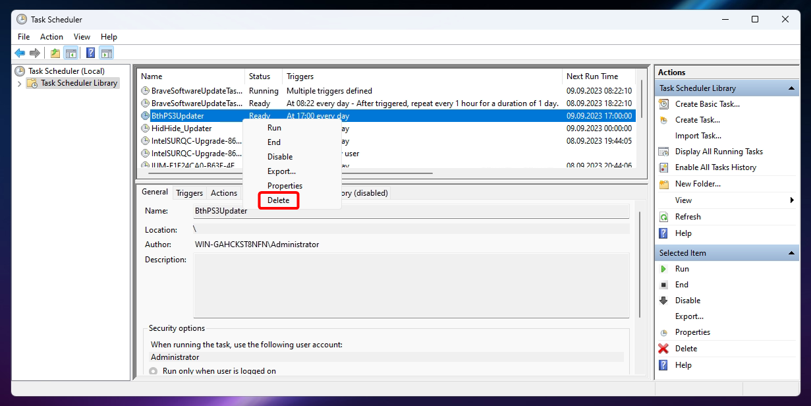
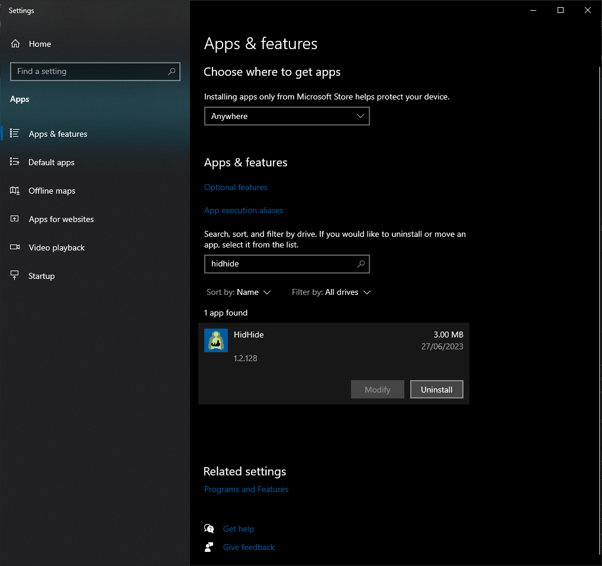
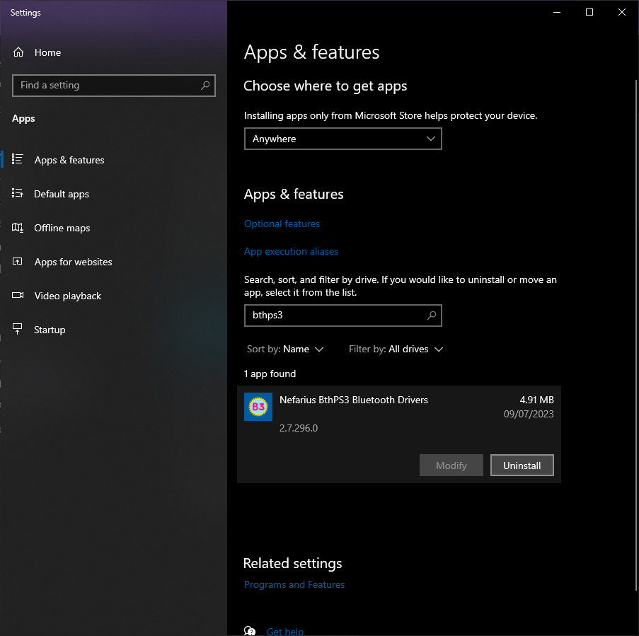
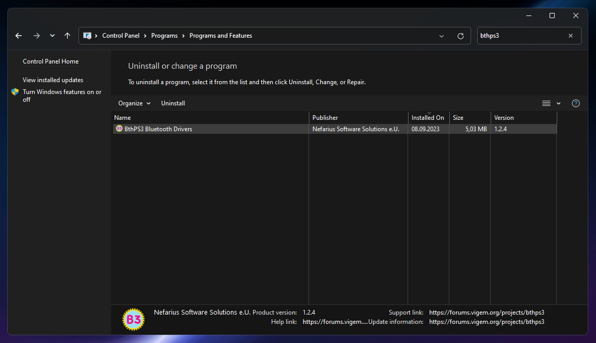

# End of Life Statement

In May 2023 a conflict with a registered trademark by ViGEM GmbH was discovered, leading to a mutual agreement between Nefarius Software Solutions e.U. and ViGEM GmbH to enter a transition phase starting July 2023 and ending approximately December 2023. As a result of the agreement, all usage of the phrase "ViGEm" (ViGEmBus etc.) and the Domain `vigem.org` will be retired and archived permanently over the agreed upon time span.

As a direct result the ViGEmBus (and client libraries) project will no longer receive any updates and has been archived/retired.

**This has no impact on existing installations except for the updater components: their auto-updaters need to be adjusted to prevent a potential security risk!** (More info on the next section)

So long, everyone, it was fun while it lasted 😄

## Adjusting the Automatic Updater Configuration

Software like ViGEmBus, HidHide and older versions of BthPS3 got shipped with an auto-updater service which periodically establishes communication with a web service hosted under `updates.vigem.org`. This service will be permanently retired after December 2023, therefore it is highly recommended to adjust their configuration so they contact the new update server from now on.

**If the updaters are not adjusted, they will continue to contact the old domain, which could lead to your public IP address getting leaked to whoever has the ownership of the domain starting from 2024.**

There are two ways of adjusting the updaters:

1. Using the Legacinator tool to automatically update them. Quick and easy!
2. Manually adjusting the configuration file for each updater

### Automatic method: using Legacinator

1. Download and execute the latest version of the [Legacinator tool](https://github.com/nefarius/Legacinator/releases)
2. Look for the "Outdated XXXXXXX Updater Configuration found" option
    - There can be up to 3 of them: one for the ViGEmBus, another for HidHide and the last one for BthPS3  
  
3. Select the options regarding the outdated configuration
4. Done! Updaters configuration adjusted!
5. Close the Legacinator window and the updater popup will close as well

### Manual methods

??? info "Adjusting the ViGEmBus updater (for Windows 10 and 11)"

    !!! warning "This is the recommended action if you're running Windows 10/11"
        If you're running ViGEm Bus Driver **v1.21.442 or older** the following section applies to you and is highly recommended to follow until software updates become available (if ever).

    Navigate to the path `C:\Program Files\Nefarius Software Solutions\ViGEm Bus Driver` and edit the file `ViGEmBus_Updater.ini` with a text editor of your choice (you will need Administrator permissions to edit). Find the following line:

    ```ini
    URL=https://updates.vigem.org/api/github/ViGEm/ViGEmBus/updates
    ```

    Change it to:

    ```ini
    URL=https://aiu.api.nefarius.systems/api/github/ViGEm/ViGEmBus/updates
    ```

    Save it an you're done! From now on the updater agent will contact the new server to check for software updates.

??? info "Adjusting the ViGEmBus updater (for Windows 7 and 8/8.1)"

    !!! warning "This is the recommended action if you're running Windows 7/8/8.1"
        If you're running ViGEm Bus Driver **v1.16.116 or older** the following section applies to you and is highly recommended to follow as there won't be any new updates made available.

    Find and open "Task Scheduler", select `Task Scheduler Library` on the left-hand side, select the `ViGEmBusUpdater` entry in the center panel, right-click it and select `Delete`:

    

    Confirm and you're done!

    

    From now on your PC will no longer check for updates and no update pop-ups will nag you ever again!

??? info "Adjusting the HidHide updater"

    !!! warning "This is the recommended action if you're running Windows 10/11"
        If you're running HidHide **v1.2.128 or older** the following section applies to you and is highly recommended to follow until software updates become available (if ever).

    Navigate to the path `C:\Program Files\Nefarius Software Solutions\HidHide` and edit the file `HidHide_Updater.ini` with a text editor of your choice (you will need Administrator permissions to edit). Find the following line:

    ```ini
    URL=https://updates.vigem.org/api/github/ViGEm/HidHide/updates
    ```

    Change it to:

    ```ini
    URL=https://aiu.api.nefarius.systems/api/github/ViGEm/HidHide/updates
    ```

    Save it an you're done! From now on the updater agent will contact the new server to check for software updates.


??? info "Removing the BthPS3 updater"

    !!! warning "This is the recommended action if you're on an older version"
        If you're running BthPS3 drivers **v1.2.4 or older** the following section applies to you and is highly recommended to follow as there won't be any new updates made available via this mechanism.

    Find and open "Task Scheduler", select `Task Scheduler Library` on the left-hand side, select the `BthPS3Updater` entry in the center panel, right-click it and select `Delete`:

    

    Confirm and you're done!

    

    From now on your PC will no longer check for updates and no update pop-ups will nag you ever again!

## Uninstall Applications

If you're not using any software relying on either ViGEmBus or HidHide you can simply uninstall them via "Apps & Features". Same can be achieved by the old "Programs and Features" section in the Control Panel.

??? info "Uninstall ViGEm Bus Driver"

    Search for `ViGEm` and uninstall:

    

??? info "Uninstall HidHide"

    Search for `HidHide` and uninstall:

    

??? info "Uninstall BthPS3"

    Search for `BthPS3` and uninstall:

    

    Alternatively via `Programs and Features` panel:

    

    Right-click the entry and select `Uninstall`. Follow the steps and you're done.

## Frequently Asked Questions

### What is any of this? Why were these things installed on my PC and why the warnings?

At some point, you (or someone who uses your computer) directly installed one of the mentioned products, or maybe used _another_ software that automatically installed them for you.

These products are legit and harmless, used along gamepads/game controllers related apps. They are:

- ViGEmBus: used for creating virtual gamepads
- HidHide: used for hiding physical/real gamepads, usually to prevent them from conflicting with virtual gamepads
- BthPS3: allows connecting PS3 controllers via Bluetooth to Windows

If you really don't know what any of these are, or think that you or any apps in your PC don't make use of them, you can follow the instructions on the "Uninstall applications" section above to get rid of them.

Regarding the warnings, as explained before, these products come with an automatic updater that tries to contact a server that won't belong to us anymore starting from 2024. Because this can be a security risk, we need you to follow the instructions in the ["Adjusting the Automatic Updater Configuration"](#adjusting-the-automatic-updater-configuration) section to prevent future issues.

### Can I trust this?

This site, the software, drivers and other products mentioned here and their updaters are all under the [Nefarius](https://euipo.europa.eu/eSearch/#details/trademarks/018878323) brand, from the developer named Benjamin Höglinger-Stelzer, A.K.A. Nefarius. You can check [his github profile link here](https://github.com/nefarius). The warning in the updaters are legit if they match what is being described in this page.

### Why does this update look and feel a bit sketchy?

The updater agent is a 3rd party product, there were only very limited options available in attempting to turn it into an "important news delivery tool". The end result was as good as we could make it 😅

### What will happen to the ViGEmBus and related products?

All archived/discontinued projects will remain available and the actively maintained ones will continue being supported, but now under the Nefarius brand name.

### Do I need to care about adjusting the updaters if I don't care about updates?

It's highly recommended to do so in order to prevent the security risk described in the ["Adjusting the Automatic Updater Configuration"](#adjusting-the-automatic-updater-configuration) section.

### This update is taking forever, the progress doesn't finish

After you hit "Next", you need to close the pink Legacinator window when done with it, then the updater will run to completion.
