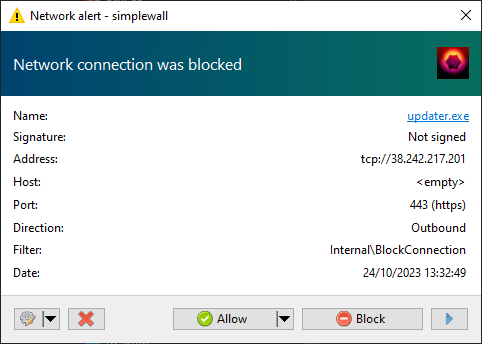
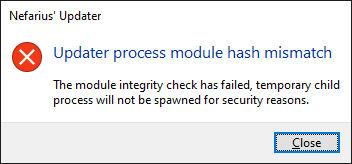

# Common Errors

The updater will try its best to not disturb the user unless absolutely necessary. Some errors can not be recovered from, though, so check out what you can do below.

## Requests blocked by firewall

Typically on vanilla Windows the Windows Firewall does not block any **outgoing** request so everything should be fine.

However if 3rd party software firewalls (like [simplewall](https://www.henrypp.org/product/simplewall)) are used, users might get a notification like...

...and would need to accept the outgoing connection for the core functionality to work.

If the connection is blocked, an error message similar to...

...might appear and needs to be rectified by the user (or the setup package the updater is bundled with).

## Invalid detection method

This error can pop up when the updater is run without any silent switches and neither the server nor the local configuration file provided any details on how to detect the version of the product it watches over.

## Updater process module hash mismatch

This error indicates that the updater was called with the [`--temporary`](Command-Line-Arguments.md#-temporary) flag outside of supported operation. I told you to not fiddle with it and that's what you get for being nosey 😆
