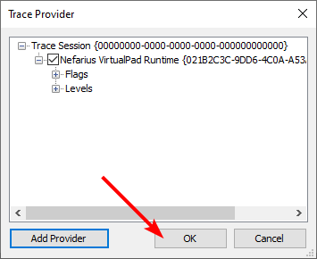

# Collecting Runtime Trace Logs

## Remote Collection, Driver and Runtime

Open a PowerShell/Windows Terminal **as Administrator**. If unsure how to do: consult a search engine of your choice 😉

Now copy and paste the following lines verbatim into the shell and press Enter:

```PowerShell
New-EtwTraceSession -Name VPadRuntime -LogFileMode 0x8100 -FlushTimer 1 -LocalFilePath "C:\VPadRuntime.etl" 2>&1 | Out-Null
Add-EtwTraceProvider -SessionName VPadRuntime -Guid '{021B2C3C-9DD6-4C0A-A53A-6183F1BE11A0}' -MatchAnyKeyword 0x0FFFFFFFFFFFFFFF -Level 0xFF -Property 0x40 2>&1 | Out-Null
Add-EtwTraceProvider -SessionName VPadRuntime -Guid '{afebad70-d5db-4a74-bda2-764d2a875aaf}' -MatchAnyKeyword 0x0FFFFFFFFFFFFFFF -Level 0xFF -Property 0x40 2>&1 | Out-Null
```

**You can now perform the action which causes the problem!**

When done, in the same shell window, copy and paste the following with an additional Enter key press:

```PowerShell
Remove-EtwTraceSession -Name VPadRuntime 2>&1 | Out-Null
```

Now **compress** (7zip, WinRAR, ...) the generated file `C:\VPadRuntime.etl` and send it to support personnel!

## Live View, Runtime only

!!! warning "This topic is for developers"
    If you've been sent this link, chances are that you do **not** need to follow this next session!

Download and install [TraceView Plus](https://www.mgtek.com/traceview) and launch it as Administrator.

Open the `Session` menu and select `Trace Provider...`:


In the upcoming dialog, choose `Add Provider`:


In the presented list, select the `Nefarius VirtualPad Runtime` entry and click OK:


Clock OK again:



Now click the little green "Plus" icon on top:


You should now see `Starting trace session.` in the lower panel:


Now the trace is running and collecting events from the runtime, example below:


